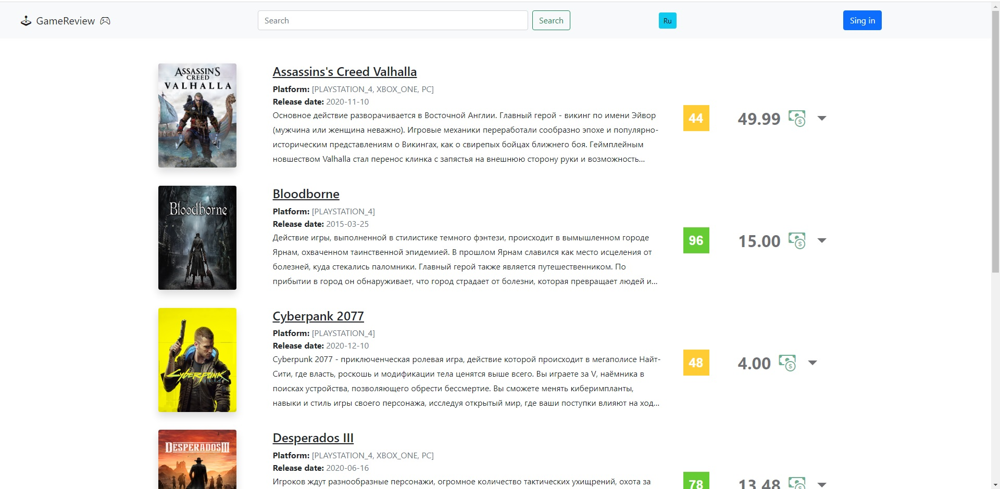
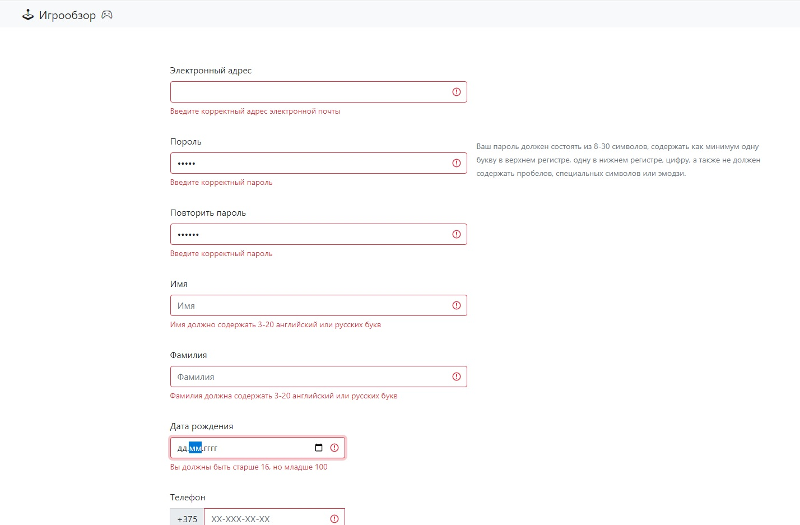
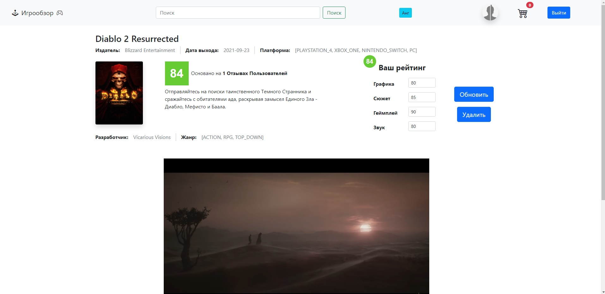
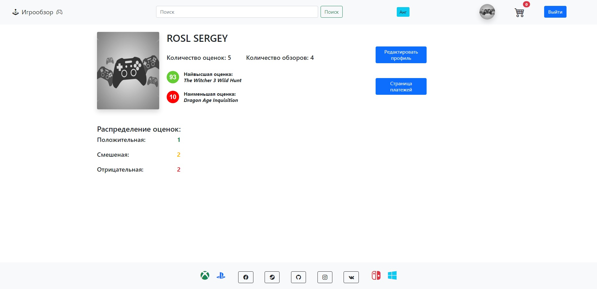
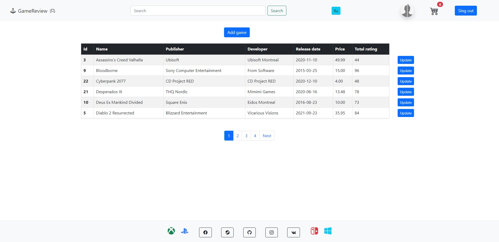

# Game Review

#### GameReview is a web application that allows users to search inforamtion about video games and see average rating from other users. Also user can public his own rating and a little review for a game. If they like any game user can buy it for famous game platfroms. There are 3 types of roles in the system: Guest, User, Administrator.

## Guest role
- Can view game catalog
- Can view a game page
- Can search for a game in the catalog
- Can register
- Can confirm his registration
- Can login
- Can change localization

## User role
- Can view game catalog
- Can view game page
- Can public, update and delete rating and review for a game
- Can read game reviews from other users
- Can view his profile
- Can edit his profile (name, surname, email, password, photo)
- Can delete his profile
- Can add, remove and see orders in shopping cart
- Can purchase games
- Can see all his purchases
- Can change localization
- Can log out

## Administrator role
- Can everything that user can
- Can view all users
- Can ban users
- Can make user admin
- Can add a new game
- Can edit game (data, image)
- Can delete game
- Can delete game reviews from other users

Database structure

